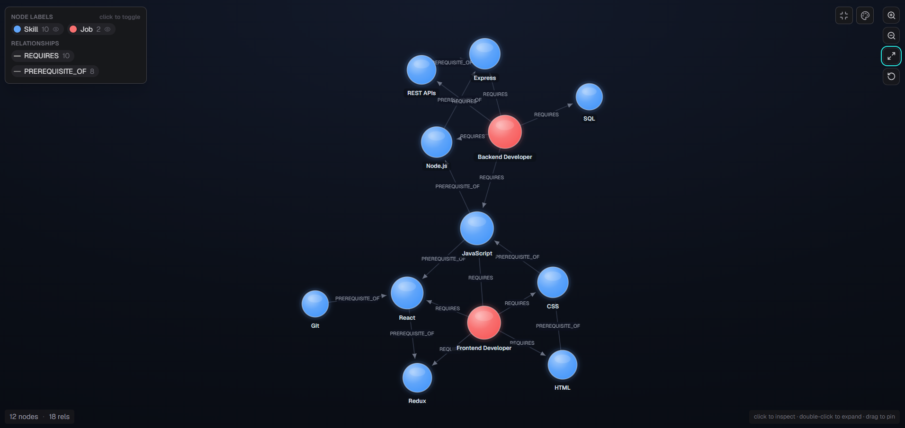
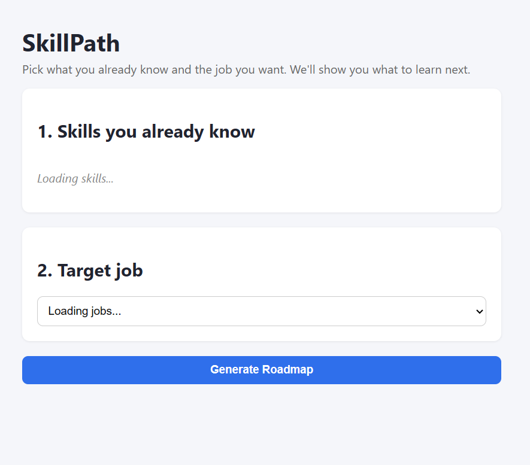
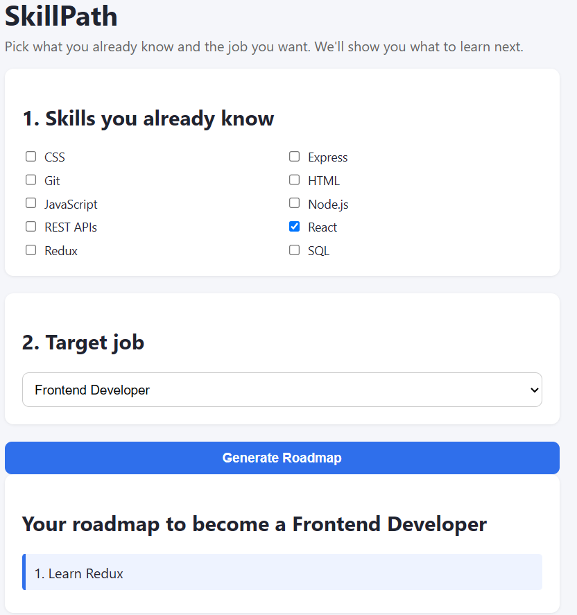

# SkillPath

Find the missing skills between what you know and the job you want — and the best order to learn them.
## Live Demo
- App: https://serene-faun-1bec62.netlify.app
- API: https://skillpath-1eex.onrender.com

## Data Model (from CognoDB)


## Screenshots



## Why a graph database?
Skills form chains (JavaScript → React → Redux), and jobs connect to many skills at once. Finding the
shortest learning path between "what I know" and "what a job needs" is a multi-hop path-finding problem.
In a relational database this needs recursive self-joins that get slow and hard to read as chains get
longer. In a graph database it's one `shortestPath()` query.

## Data model

```
(:Skill {name})-[:PREREQUISITE_OF]->(:Skill {name})
(:Job {title})-[:REQUIRES]->(:Skill {name})
```

## Project structure

```
skillpath/
├── backend/
│   ├── package.json
│   ├── .env.example
│   └── src/
│       ├── db.js               # CognoDB connection
│       ├── seed.js             # loads sample data
│       ├── server.js           # Express app entry point
│       ├── queries/
│       │   └── skillPathQuery.js  # the Cypher path-finding logic
│       └── routes/
│           ├── skills.js
│           ├── jobs.js
│           └── roadmap.js
└── frontend/
    ├── index.html
    ├── style.css
    └── app.js
```

## Setup

1. Create a free CognoDB instance at https://console.cognodb.com/signup, save the URI and password.
2. `cd backend && npm install`
3. `cp .env.example .env` and fill in your CognoDB URI/password.
4. `npm run seed` — loads sample skills, jobs, and prerequisite links.
5. `npm start` — starts the API on http://localhost:4000
6. Open `frontend/index.html` in your browser (or serve it with any static server).

## Main query explained

`findLearningPath(knownSkills, jobTitle)` in `skillPathQuery.js`:
1. Finds which of the job's required skills the user doesn't already know.
2. Runs `shortestPath()` from each known skill to each missing skill, following `PREREQUISITE_OF`
   relationships up to 6 hops.
3. Flattens the chains into one ordered, de-duplicated list — the roadmap. 
